# Sample Routing Module

A modular embedded communication project designed to simulate a small industrial or medical machine architecture.

---

# English

## Project Overview

The current system is based on:

- Raspberry Pi 4 Model B as master node
- STM32 NUCLEO-F207ZG as slave node
- RS485 physical layer
- Custom SRM binary protocol
- CRC16 frame validation
- RX ring buffer handling
- Modular parser / dispatcher architecture
- LCD1602 I2C display integration
- LED control and status monitoring
- Menu-driven Raspberry test application

The goal of the project is to create a scalable embedded framework that can later support:

- Multiple slave nodes
- LCD modules
- EEPROM memory
- Stepper motors
- Servo motors
- I2C sensors
- CAN bus
- WiFi or Ethernet gateway
- Distributed actuator and sensor control

---

## Current Milestone

The current implementation supports:

- Bidirectional RS485 communication
- Binary SRM frames
- CRC16 validation
- RX ring buffer
- Frame parser
- Command dispatcher
- Request / response protocol
- Source and destination addressing
- Sequence numbers
- Raspberry text menu
- STM32 LED ON / LED OFF control
- STM32 STATUS response
- LCD1602 I2C driver
- LCD clear command
- LCD line 1 write command
- LCD line 2 write command
- READY / PONG machine-style LCD feedback

### Implemented Commands

- `PING_REQ / PING_RSP`
- `LED_ON_REQ / LED_ON_RSP`
- `LED_OFF_REQ / LED_OFF_RSP`
- `STATUS_REQ / STATUS_RSP`
- `LCD_CLEAR_REQ / LCD_CLEAR_RSP`
- `LCD_WRITE_LINE1_REQ / LCD_WRITE_LINE1_RSP`
- `LCD_WRITE_LINE2_REQ / LCD_WRITE_LINE2_RSP`

### STATUS_RSP Returns

- LED state
- System uptime in milliseconds

---

## Why RS485 Was Chosen

RS485 was selected because it is widely used in:

- Industrial automation
- Embedded systems
- Machine control
- Distributed devices
- Medical equipment

Compared to a direct UART connection, RS485 offers:

- Better noise immunity
- Longer cable distances
- Differential signaling
- Support for multiple devices on the same bus
- Higher reliability in industrial environments
- Better scalability for future multi-node systems

This makes RS485 a realistic choice for a project inspired by industrial and medical equipment.

---

## Why a Custom Binary Protocol Was Chosen

A custom binary protocol was chosen instead of plain text commands because it is:

- Faster
- More compact
- Easier to validate
- More scalable
- More realistic for industrial applications
- Easier to extend with new commands and payloads

Text protocols are simple to debug but become inefficient when many commands, sensors, or slave nodes are added.

### SRM Frame Format

```text
SOF | VER | FLAGS | SRC | DST | CMD | SEQ | LEN | PAYLOAD | CRC16
```

### Frame Field Description

| Field | Size | Meaning | Purpose |
|-------|------|----------|----------|
| SOF | 8 bit | Start of Frame | Identifies the beginning of a valid SRM frame. The current value is `0xAA`. |
| VER | 8 bit | Protocol Version | Allows future protocol evolution while maintaining backward compatibility. The current version is `0x01`. |
| FLAGS | 8 bit | Frame Flags | Reserved for future use such as ACK, NACK, broadcast, priority, or error flags. Currently set to `0x00`. |
| SRC | 8 bit | Source Address | Identifies the sender of the frame. Example: Raspberry Pi master address. |
| DST | 8 bit | Destination Address | Identifies the intended receiver of the frame. Example: STM32 slave address. |
| CMD | 8 bit | Command Identifier | Specifies which operation must be executed, such as PING, LED ON, STATUS, or LCD WRITE. |
| SEQ | 8 bit | Sequence Number | Used to match requests and responses and to detect duplicate or missing frames. |
| LEN | 8 bit | Payload Length | Indicates the number of bytes contained in the payload field. |
| PAYLOAD | Variable | Command Data | Contains the actual data associated with the command. Its size depends on the command type. |
| CRC16 | 16 bit | Frame Validation | Used to detect transmission errors and validate the integrity of the complete frame. |


### Example Frame Breakdown
| Byte(s)     | Meaning          |
| ----------- | ---------------- |
| AA          | SOF              |
| 01          | VER              |
| 00          | FLAGS            |
| 01          | SRC              |
| 10          | DST              |
| 20          | CMD              |
| 05          | SEQ              |
| 04          | LEN              |
| 54 45 53 54 | PAYLOAD = "TEST" |
| 3F 92       | CRC16            |


## Example Frame

```text
AA 01 00 01 10 20 05 04 54 45 53 54 3F 92
```

This structure allows:

Multi-slave addressing
Command expansion
Frame validation
Error detection
Reliable request / response behavior

## Example Communication Flow

1. Raspberry sends `LCD_WRITE_LINE1_REQ`
2. STM32 validates frame and CRC
3. STM32 dispatches the command
4. STM32 updates LCD line 1
5. STM32 sends `LCD_WRITE_LINE1_RSP`
6. Raspberry validates response and CRC

## LCD Write Command Flow

The following diagram shows how an LCD line update command is processed between the Raspberry Pi master, the STM32 slave and the LCD1602 display.

```mermaid
flowchart LR

    A[Raspberry Pi 4<br>Master]
    B[STM32 F207ZG<br>Slave]
    C[Validate<br>Frame]
    D[Check<br>CRC16]
    E[Decode<br>Command]
    F[LCD1602<br>Update Display]
    G[Send LCD_WRITE_LINE1_RSP]
    H[Master Validates<br>Response + CRC16]

    A -->|LCD_WRITE_LINE1_REQ via RS485| B
    B --> C
    C --> D
    D --> E
    E --> F
    F --> G
    G --> H


    style A fill:#DCE6F2,stroke:#4A6FA5,stroke-width:2px,color:#000
    style B fill:#E2F0D9,stroke:#70AD47,stroke-width:2px,color:#000
    style C fill:#FFF2CC,stroke:#D6B656,stroke-width:2px,color:#000
    style D fill:#FFF2CC,stroke:#D6B656,stroke-width:2px,color:#000
    style E fill:#FFF2CC,stroke:#D6B656,stroke-width:2px,color:#000
    style F fill:#FCE4D6,stroke:#C55A11,stroke-width:2px,color:#000
    style G fill:#D9EAD3,stroke:#6AA84F,stroke-width:2px,color:#000
    style H fill:#DCE6F2,stroke:#4A6FA5,stroke-width:2px,color:#000
```




The same mechanism is also used for:

- PING
- LED control
- STATUS reporting
- LCD clear
- LCD line 2 update

## Current Hardware

Raspberry Pi 4 Model B master board
STM32 NUCLEO-F207ZG slave board
RS485 transceiver
USB to RS485 converter
LCD1602 I2C display
On-board STM32 user LED

---

## Current Firmware Modules

### Raspberry side
| Module                | Description                                                          |
| --------------------- | -------------------------------------------------------------------- |
| `main.c`              | Entry point of the Raspberry application                             |
| `menu_test.c`         | Text-based command menu and test functions                           |
| `serial_port.c`       | Linux serial communication with the RS485 adapter                    |
| `srm_frame_builder.c` | Builds outgoing SRM binary frames                                    |
| `srm_crc.c`           | Calculates and validates CRC16 values                                |
| `srm_defs.h`          | Command IDs, protocol constants, frame sizes, and shared definitions |
| `config.h`            | Serial port and configuration parameters                             |

### STM side 
| Module             | Description                                              |
| ------------------ | -------------------------------------------------------- |
| `main.c`           | Minimal STM32 startup file generated by CubeMX / CubeIDE |
| `app_main.c`       | Main application logic                                   |
| `rs485_if.c`       | Low-level RS485 communication                            |
| `uart_if.c`        | UART abstraction layer                                   |
| `srm_rx_buffer.c`  | RX ring buffer                                           |
| `srm_rx_parser.c`  | Incoming frame parser                                    |
| `srm_dispatcher.c` | Command dispatcher                                       |
| `srm_crc.c`        | CRC16 calculation and validation                         |
| `srm_defs.h`       | Shared protocol definitions                              |
| `lcd.c`            | LCD1602 I2C driver                                       |
| `lcd_ui.c`         | LCD machine-state helper functions                       |
| `debug_console.c`  | Debug output through Virtual COM / USART3                |

---


## Wiring

### STM32 NUCLEO-F207ZG Pin Mapping

| Function    | STM32 Pin | External Device    |
| ----------- | --------- | ------------------ |
| RS485 TX    | PB6       | RS485 module RX    |
| RS485 RX    | PB7       | RS485 module TX    |
| LCD I2C SCL | PB8       | LCD1602 I2C SCL    |
| LCD I2C SDA | PB9       | LCD1602 I2C SDA    |
| Stepper IN1 | PD4       | ULN2003 IN1        |
| Stepper IN2 | PD5       | ULN2003 IN2        |
| Stepper IN3 | PD6       | ULN2003 IN3        |
| Stepper IN4 | PD7       | ULN2003 IN4        |
| User LED    | PA5       | On-board STM32 LED |

### LCD1602 I2C Wiring

| LCD Pin | STM32 Pin |
| ------- | --------- |
| VCC     | 5V        |
| GND     | GND       |
| SDA     | PB9       |
| SCL     | PB8       |

### ULN2003 Stepper Driver Wiring

| ULN2003 Pin | STM32 Pin   |
| ----------- | ----------- |
| IN1         | PD4         |
| IN2         | PD5         |
| IN3         | PD6         |
| IN4         | PD7         |
| VCC         | External 5V |
| GND         | GND         |

---

## Stepper Motor Features

The final version of the project supports:

* Clockwise stepper rotation
* Counter-clockwise stepper rotation
* Software HOME return movement
* LCD feedback during movement
* Raspberry Pi menu integration

### Stepper Commands

* `STEPPER_CW_REQ / STEPPER_CW_RSP`
* `STEPPER_CCW_REQ / STEPPER_CCW_RSP`
* `STEPPER_HOME_REQ / STEPPER_HOME_RSP`

### HOME Function

The HOME command is currently implemented in software.

The stepper motor rotates in the reverse direction for a predefined number of steps in order to approximately return to its initial position.

A future improvement would be adding:

* Mechanical limit switch
* Optical sensor
* Hall sensor
* Real hardware homing reference

This would make the HOME function more accurate and closer to a real industrial machine.

---

# Italiano

## Descrizione del progetto

Il progetto SRM (Sample Routing Module) simula una piccola architettura embedded industriale o medicale.

Il sistema utilizza:

* Raspberry Pi 4 come master
* STM32 NUCLEO-F207ZG come slave
* Comunicazione RS485
* Protocollo binario proprietario
* Validazione CRC16
* Display LCD1602 I2C
* Controllo LED
* Controllo stepper motor

### Funzioni attualmente supportate

* PING
* LED ON / OFF
* STATUS
* LCD CLEAR
* LCD WRITE LINE 1
* LCD WRITE LINE 2
* STEPPER CW
* STEPPER CCW
* STEPPER HOME

---

# Eesti keel

## Projekti kirjeldus

SRM (Sample Routing Module) projekt simuleerib väikest tööstuslikku või meditsiinilist embedded süsteemi.

Süsteem kasutab:

* Raspberry Pi 4 master seadmena
* STM32 NUCLEO-F207ZG slave seadmena
* RS485 sidet
* Kohandatud binaarprotokolli
* CRC16 kontrolli
* LCD1602 I2C ekraani
* LED juhtimist
* Samm-mootori juhtimist

### Praegused funktsioonid

* PING
* LED ON / OFF
* STATUS
* LCD CLEAR
* LCD WRITE
* STEPPER CW
* STEPPER CCW
* STEPPER HOME

---

# Русский

## Описание проекта

Проект SRM (Sample Routing Module) моделирует небольшую промышленную или медицинскую embedded-систему.

Система использует:

* Raspberry Pi 4 как master
* STM32 NUCLEO-F207ZG как slave
* Связь RS485
* Пользовательский бинарный протокол
* Проверку CRC16
* LCD1602 I2C дисплей
* Управление LED
* Управление шаговым двигателем

### Поддерживаемые функции

* PING
* LED ON / OFF
* STATUS
* LCD CLEAR
* LCD WRITE
* STEPPER CW
* STEPPER CCW
* STEPPER HOME
